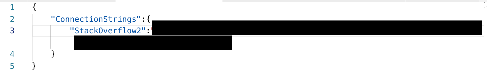

# Demo

Cette application compare en lecture seule les deux modes d'accès aux données suivants: EF Core et ADO.NET.

## Configuration

Vous trouverez dans le projet un exemple de configuration de la connection string utilisée tant par ADO.NET que par EF Core. 

La **connection string** est stockée hors du code pour des raisons de sécurité (ex: stockage des sources dans des repositories partagés, parfois publics) et de flexibilité (possibilité de cibler une autre instance de SQL Server sans devoir redémarrer). Elle est contenue dans un fichier nommé **appsettings.json**. Voir https://docs.microsoft.com/en-us/ef/core/miscellaneous/connection-strings. Vous pourriez également la stocker dans d'autres conteneurs, tels que des variables d'environnement ou encore les user secrets. Pour plus d'informations sur les possibilités de configuration embarquées en dotnet core, voir https://docs.microsoft.com/en-us/aspnet/core/fundamentals/configuration/?view=aspnetcore-2.1 

**Gestion des sources**: Vous veillerez à utiliser une règle d'exclusion du fichier appsettings.json dans votre fichier gitignore, afin de ne pas inclure au repository votre fichier appsettings, sans quoi vos efforts auront été vains. 

Voir aussi http://ighenallux.pbworks.com/w/page/121274721/Gestion%20de%20la%20connection%20string 

Vous pouvez également (après avoir lu la documentation officielle) vous tourner vers le blog suivant: https://garywoodfine.com/configuration-api-net-core-console-application/ qui décrit comment intégrer à une application existante la configuration en utilisant un fichier json. Attention: il faudra veiller à adapter les versions de .netcore. 

## Exécution

Assurez-vous que le répertoire de votre projet contienne bien un fichier appsettings.json qui contienne un objet "ConnectionStrings" et une connexion dont la clé est "StackOverflow2".



Restaurez les packages Nuget

```
dotnet restore
```

Compilez

```
dotnet build
```

Exécutez

```
dotnet run
```