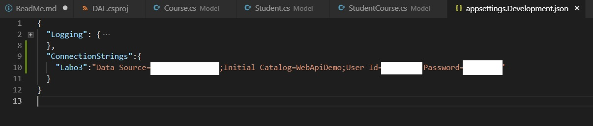

# Web API ASP.NET Core utilisant Entity Framework Core

Ce projet de démo tente d'illustrer la manière de réaliser certaines opérations courantes (CRUD) dans une API REST réalisée en ASP.NET Core utilisant EF Core. Il s'appuie sur le domaine que vous avez utilisé pour le labo DAL dans le cadre du cours. (notion de **Student**, **Course**, **StudentCourse**)

Lisez bien les commentaires répartis dans le code. 

Privilégiez les versions asynchrones des méthodes lorsque celles-ci sont disponibles.

Si votre code ne compile pas suite à des erreurs de types "méthodes inconnues", vérifiez bien les namespaces. En effet, beaucoup de méthodes utilisées en EF Core ou en Linq sont des méthodes d'extension.

## Configuration

Dans le répertoire des sources de votre API, créez un fichier appSettings.json ou utilisez le fichier appSettings.Development.json. Placez-y la connection string. La base de données se situe sur le serveur habituel. Connectez-vous à cette dernière à l'aide de votre login/mdp. 

## Remarques sur l'API

L'API utilise AutoMapper pour faciliter la tâche de projection d'un modèle vers un autre (DTO<->Data Model). AutoMapper nécessite de la configuration (tel type mappé vers tel autre type...). Regardez la classe Startup.cs pour en apprendre davantage sur celle-ci et lisez [la documentation sur les profils](http://docs.automapper.org/en/stable/Configuration.html). 

De plus, le mapper est injecté aux différents controllers. Cela nécessite de  configurer l'injection de dépendances. Voir 
- la classe Startup 
- [la documentation officielle](https://docs.microsoft.com/en-us/aspnet/core/fundamentals/dependency-injection?view=aspnetcore-2.1)
- [la documentation de AutoMapper pour intégration à ASP.NET Core](https://dotnetcoretutorials.com/2017/09/23/using-automapper-asp-net-core/)

## Exécution du code

Cette solution est constituée de plusieurs projets: 
* api : l'API REST (.NET Core 2.1)
* Model: le modèle du domaine d'application
* DAL : la couche de persistence de ce modèle
* Tests: de type [mstest](https://github.com/dotnet/docs/blob/master/docs/core/testing/unit-testing-with-mstest.md). Il s'agit de tests unitaires. 

Le projet de test illustre comment appeler la DAL (différents cas de tests). 

Avant d'utiliser les tests, assurez-vous qu'un fichier nommé appsettings.json existe à la racine du projet de tests et contient la connection string adéquate (voir section "configuration" ci-dessus). 

## Remarques

Le code de la DAL mélange méthodes synchrones et asynchrones pour illustrer que les deux approches sont possibles. Dans la mesure du possible, privilégiez les versions asynchrones des méthodes pour améliorer les performances.

## Aller plus loin

Essayez vous-même de créer du comportement similaire à celui de ce projet exemple. Lorsqu'on voit les choses "toutes faites", elles semblent évidentes. Lorsqu'il faut les créer soi-même, c'est autre chose et ce n'est qu'à ce moment-là que les déclics se feront. 

Essayez par exemple de créer un nouveau modèle sur base de la DB StackOverflow2 disponible sur le serveur de l'IESN et tentez d'exploiter ce dernier. 

