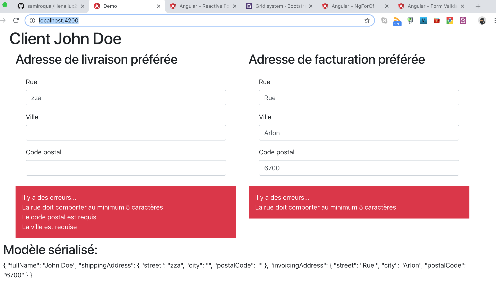

# Demo components and interaction

This is a demo of a reusable address editor component. In this project, the app-component displays a user's info. The app-address component is used once for the shipping address and once for the billing address of a customer. The validation logic is encapsulated inside the app-address component. 

The app-address component receives in **Input** the address on which it'll be active. It then tells the outside when the address changes and uses two-way binding to achieve that (see the **Output** named the same as the input + the **change** suffix). 

You can check that the parent component receives the updates by having a look at the serialized model (at the bottom of the view).

You can also have a look at the way the form is created using the [Reactive Form](https://angular.io/guide/reactive-forms) approach. You'll use this approach in the Weather App. You can also have a look at how the component displays validation errors to the user using [Form Validation](https://angular.io/guide/form-validation#reactive-form-validation).




This project was generated with [Angular CLI](https://github.com/angular/angular-cli) version 6.2.2.

## How to run this app?

Clone the repository, checkout the main branch and open a command prompt. Navigate to your local repository and use the following command to restore dependencies.

```
npm install
```

Then start the development server and the Angular build process by using the following command.

```
ng serve
```

## Development server

Run `ng serve` for a dev server. Navigate to `http://localhost:4200/`. The app will automatically reload if you change any of the source files.

## Build

Run `ng build` to build the project. The build artifacts will be stored in the `dist/` directory. Use the `--prod` flag for a production build.
